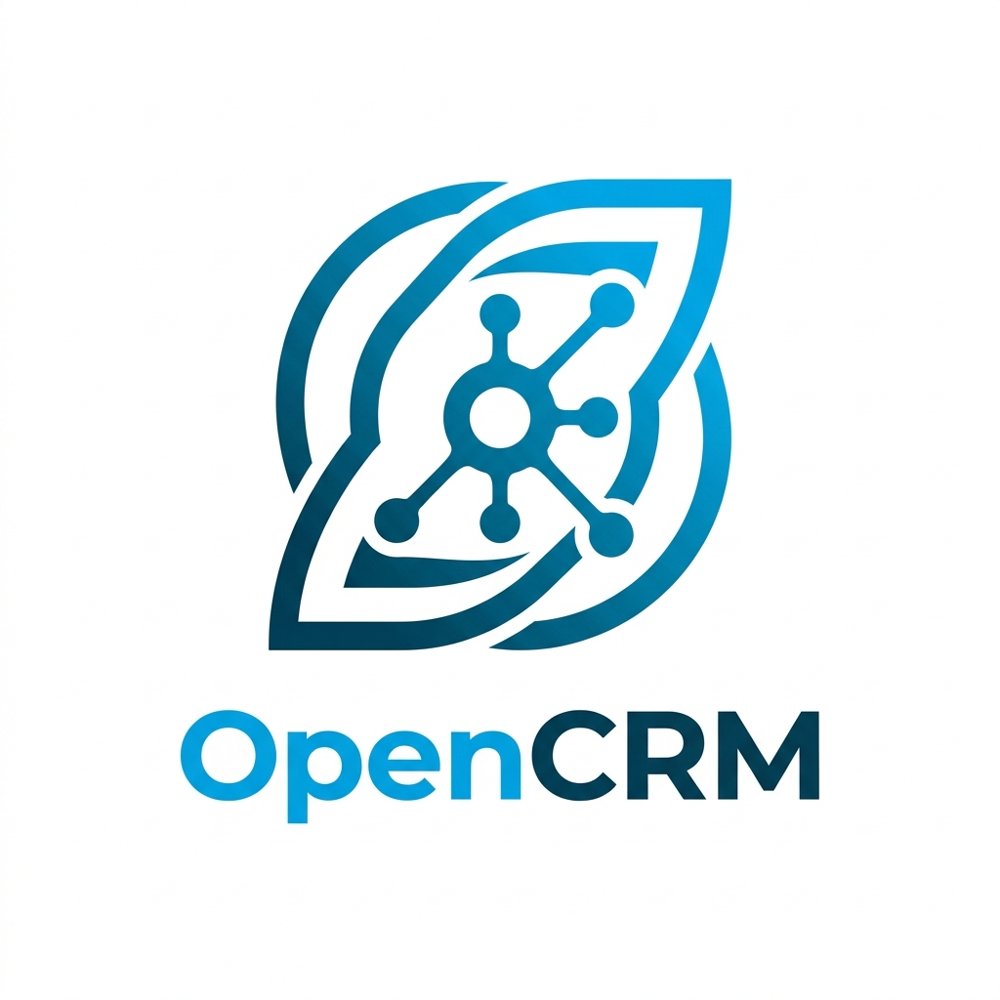
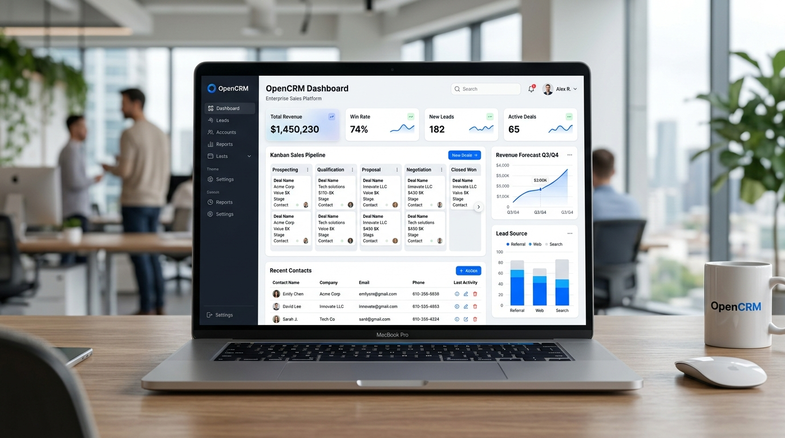
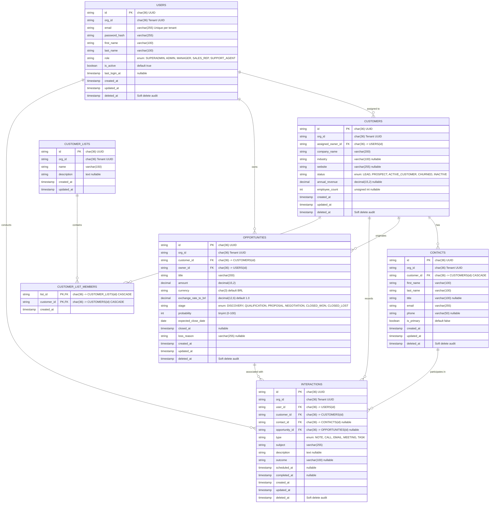
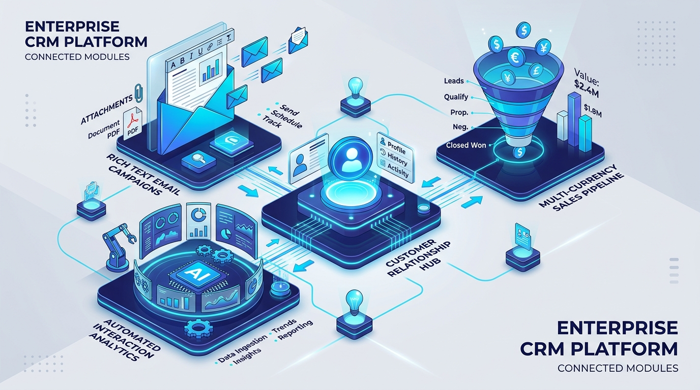

<p align="center">
  
</p>

<h1 align="center">OpenCRM - Enterprise CRM Platform</h1>

<p align="center">
  <strong>Modern, Secure & Scalable Customer Relationship Management Platform</strong><br>
  Built with NestJS Hexagonal Architecture & Angular 22 Domain-Driven Design
</p>

<p align="center">
  
</p>

---

A robust, enterprise-ready Customer Relationship Management web application engineered with modern architectural standards:
- **Backend**: NestJS adhering strictly to **Hexagonal Architecture (Ports and Adapters)**.
- **Database**: MySQL 8.4 normalized relational schema with indexing strategies for high-frequency queries.
- **Cache & Throttling**: Redis 7 for cache-aside reads, token family lifecycle/revocation, and distributed rate limiting.
- **Security**: JWT stateless access tokens with refresh token rotation and breach detection, argon2/bcrypt password hashing, RBAC & ABAC policy guards.
- **Frontend**: Angular 22 application following **Domain-Driven Design (DDD)** principles, Angular Material 3 theming, NgRx SignalStore, WCAG 2.1 AA accessibility, and Progressive Web App (PWA) readiness.
- **Currency**: Multi-currency support with **Brazilian Real (BRL)** as the default primary currency.

---

## Repository Structure (Polyrepo Layout)

```text
OpenCRM/
├── backend/                  # NestJS Hexagonal Application
│   ├── src/
│   │   ├── core/             # Pure Domain & Application layers (Framework agnostic)
│   │   │   ├── domain/       # Aggregates, Entities, Value Objects, Domain Events, Ports
│   │   │   └── application/  # Use Cases, Command/Query Handlers, DTOs
│   │   └── infrastructure/   # Adapters (REST, TypeORM MySQL, Redis, Auth)
│   ├── test/                 # Integration and E2E test suites
│   ├── Dockerfile            # Multi-stage production container
│   └── package.json
│
├── frontend/                 # Angular 22 DDD Application
│   ├── src/app/
│   │   ├── core/             # Auth interceptors, guards, global services
│   │   ├── shared/           # Reusable UI components (Material 3), pipes, directives
│   │   └── domains/          # Bounded Contexts (customer, opportunity, interaction)
│   ├── Dockerfile            # Multi-stage Nginx container
│   └── package.json
│
├── docker-compose.yml        # Local development orchestration (MySQL, Redis, Backend, Frontend)
├── .env.example              # Environment variables template
└── README.md
```

---

## Data Architecture & Entity-Relationship Diagram (ERD)

The OpenCRM database is designed with a multi-tenant, normalized relational schema in MySQL 8.4. Every domain entity is partitioned by `org_id` for multi-tenant isolation, supports soft deletion (`deleted_at`), and includes indexing strategies for high-frequency queries.



### Key Relationships & Data Integrity

1. **Multi-Tenancy**: Every business entity contains an `org_id` partition key ensuring tenant boundary isolation.
2. **Customer & Contacts (1:N)**: A customer account can have multiple point-of-contacts with exactly one designated as `is_primary`. Deleting a customer cascades to its contacts.
3. **Customer Lists (N:M)**: Dynamic and static segmented groups of customers for mass mailing and marketing campaigns, connected through the `customer_list_members` junction table.
4. **Sales Pipeline & Opportunities (1:N)**: Deals originate from customer accounts, are assigned to a sales representative owner, and support multi-currency conversion with BRL as baseline.
5. **Customer Interactions Timeline (Polymorphic Association)**: Records calls, notes, direct commercial emails (with file attachments), and mass campaigns. Associated with a Customer, optional Contact, and optional Opportunity.

<p align="center">
  
</p>

---

## Quick Start

### 1. Start Infrastructure (Docker Compose)
```bash
docker compose up -d mysql redis
```

### 2. Run Backend
```bash
cd backend
cp ../.env.example .env
npm install
npm run start:dev
```
API runs at `http://localhost:3000`  
Swagger Documentation: `http://localhost:3000/api/docs`

### 3. Run Frontend
```bash
cd frontend
npm install
npm start
```
Frontend runs at `http://localhost:4200`
